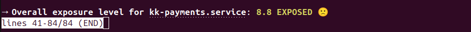
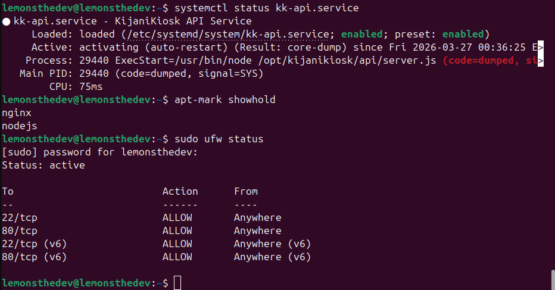

# kk-payments Hardening Report (Review Copy)

This is a polished review copy of the service hardening notes for kk-payments. It preserves the original ideas, organizes them into a clear security narrative, and highlights both protections and runtime trade-offs.

## Executive Summary

- The service is hardened using layered systemd sandboxing controls.
- File system, kernel, identity, and networking protections significantly reduce attack surface.
- Two aggressive controls caused runtime instability in Node.js:
  - MemoryDenyWriteExecute
  - Overly restrictive SystemCallFilter
- A calibrated syscall policy restores stability while keeping strong containment.

## Hardening Phases

### Phase 1: File System Isolation ("Safe Room")

| Security Feature | Real-World Analogy | What it prevents |
| --- | --- | --- |
| ProtectSystem=strict | "Look but do not touch" rule | Makes most of the host read-only to the service, preventing tampering with system files and binaries. |
| ProtectHome=yes | "Invisible room" | Hides user home directories (for example /home/ubuntu), reducing data theft risk. |
| PrivateTmp=yes | "Personal shredder" | Gives the service an isolated temporary area and prevents shared /tmp abuse. |
| ReadWritePaths=/opt/kijanikiosk/shared/logs | "Mail slot" | Reopens write access only for the log path so logging works without broad host write access. |

### Phase 2: Kernel and Hardware Safeguards ("Engine Room")

| Security Feature | Real-World Analogy | What it prevents |
| --- | --- | --- |
| PrivateDevices=yes | "No tools" rule | Blocks direct access to host device nodes and hardware interfaces. |
| ProtectKernelTunables=yes | "Do not touch thermostat" rule | Prevents runtime kernel parameter manipulation. |
| ProtectControlGroups=yes | "Shared resources lock" | Reduces risk of CPU/RAM abuse and service-level denial of service. |
| RestrictSUIDSGID=yes | "No fake IDs" rule | Blocks common privilege transition vectors via setuid/setgid behaviors. |

### Phase 3: Identity and Communication Controls ("One-Way Lock")

| Security Feature | Real-World Analogy | What it prevents |
| --- | --- | --- |
| NoNewPrivileges=yes | "One-way lock" | Prevents privilege escalation after process start. |
| CapabilityBoundingSet= | "No superpowers" | Removes Linux capabilities and limits privileged kernel operations. |
| RestrictAddressFamilies=AF_INET AF_INET6 AF_UNIX | "Language filter" | Restricts socket families to required network paths only. |
| SystemCallFilter | "Approved vocabulary" | Restricts kernel-call surface available to the service. |

### Phase 4: Anti-Exploit and Host Integrity Controls

| Security Feature | Real-World Analogy | What it prevents |
| --- | --- | --- |
| MemoryDenyWriteExecute | "Ink is permanent" | Blocks write+execute memory patterns used by many code injection exploits. |
| LockPersonality=yes | "Stay yourself" rule | Prevents legacy execution personality abuse. |
| ProtectKernelModules=yes | "No brain surgery" | Blocks module-level kernel tampering paths. |
| ProtectKernelLogs=yes | "Blindfold" | Restricts access to sensitive kernel logs that support reconnaissance. |

### Phase 5: Namespace and Time Integrity Controls

| Security Feature | Real-World Analogy | What it prevents |
| --- | --- | --- |
| RestrictNamespaces=yes | "Mirror maze lock" | Prevents namespace-based isolation abuse used to hide malicious execution. |
| ProtectKernelLogs=yes | "Security camera guard" | Continues to limit host reconnaissance through kernel messages. |
| ProtectClock=yes | "Time capsule" rule | Prevents system time manipulation that can affect certs, auditing, and auth checks. |

## Consolidated Directive Set

```ini
# Core file system containment
ProtectSystem=strict
ProtectHome=yes
PrivateTmp=yes
ReadWritePaths=/opt/kijanikiosk/shared/logs

# Host and kernel safety
PrivateDevices=yes
ProtectKernelTunables=yes
ProtectControlGroups=yes
RestrictSUIDSGID=yes

# Identity and communication constraints
NoNewPrivileges=yes
CapabilityBoundingSet=
RestrictAddressFamilies=AF_INET AF_INET6 AF_UNIX

# Integrity protections
LockPersonality=yes
ProtectKernelModules=yes
ProtectKernelLogs=yes
RestrictNamespaces=yes
ProtectClock=yes
```

## Why the Service Crashed Under Maximum Hardening

### 1. Memory Conflict: MemoryDenyWriteExecute

- Goal:
  - Block attacks that write payloads into memory and execute them.
- Conflict with Node.js:
  - Node.js uses JIT compilation, which writes executable memory dynamically.
- Runtime effect:
  - Kernel terminated the process when policy and runtime behavior collided.

### 2. Syscall Conflict: Overly Tight SystemCallFilter

- Goal:
  - Allow only a minimal set of system calls.
- Conflict with Node.js:
  - Node.js needs networking, signal handling, and timer-related syscalls.
- Runtime effect:
  - Missing syscall permissions triggered SIGSYS-style termination behavior.

## Stability-First Security Calibration

| Setting | Why it was added | Outcome |
| --- | --- | --- |
| SystemCallFilter=@system-service @network-io @signal @timer | Expands allow list to required Node.js syscall groups. | Service remains stable while still blocking a large set of dangerous syscalls. |
| SystemCallErrorNumber=EPERM | Returns permission denied instead of immediate kill on blocked calls. | Prevents unnecessary process crashes and improves production resilience. |

## Security Posture After Calibration

- Hardening remains strong (read-only host posture, strict privilege model, reduced kernel surface).
- Node.js runtime requirements are now accommodated.
- Residual risk is lower than baseline while reliability is significantly better than maximum-aggression defaults.

## Evidence

### Before Hardening

> Replace the placeholder filename below with the exact screenshot you want to embed.


Example:



### After Hardening

> Replace the placeholder filename below with the exact screenshot you want to embed.


Example:




